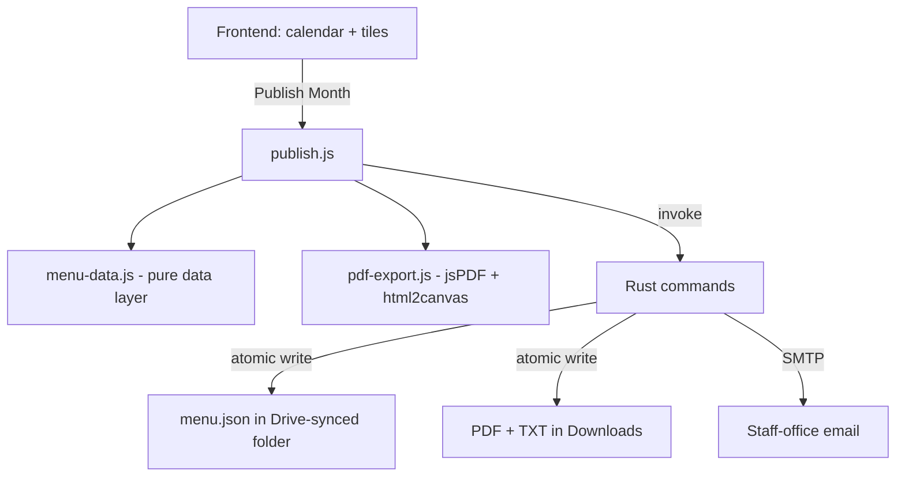

# Developer Guide: Lunch Menu Publisher

## 1. Introduction

**Lunch Menu Publisher** is a local-first Tauri v2 desktop app for creating and
publishing one school lunch menu per month. The core idea: the user builds a
month in the calendar, then presses **Publish Month** — one action that
produces all required outputs (PDF, SIS TXT, `menu.json`, staff-office email).

The product is deliberately narrow:

- One user, one laptop, one menu per month.
- No accounts, no cloud API, no Google Drive API, no collaboration, no
  archive/history system.
- Milk is a fixed staple shown automatically on school days.
- "Specials" keep their name and are clearly labeled as teacher/12th-grade
  offerings.

## 2. Architecture

A single Tauri v2 desktop app: a vanilla-JS web frontend (no framework, no
bundler — plain `<script>` tags) plus a Rust backend exposing a small set of
Tauri commands. All application state lives in `localStorage`.



### Why custom Rust commands instead of plugins

All native work (folder picker, file writes, SMTP) is implemented as
application commands in `src-tauri/src/main.rs` using `rfd` (native folder
picker) and `std::fs`. No Tauri plugins, no capability files needed — commands
registered via `tauri::Builder::invoke_handler` are callable by every window
without ACL permissions. `app.withGlobalTauri: true` exposes `window.__TAURI__`
to the non-bundler frontend (the default is `false`).

## 3. Frontend

### 3.1 Module layout (`js/`)

| File | Responsibility |
|------|----------------|
| `state.js` | State + localStorage persistence with rollback; settings; SMTP test helper |
| `menu-data.js` | **Pure data layer** (no DOM/localStorage): `menu.json` builder, TXT generator, missing-entrée counter, publish-plan builder. Node-testable. |
| `publish.js` | Publish Month modal: confirmation checklist, execution, honest results, published badge, test email |
| `pdf-export.js` | Real PDF blob generation via vendored jsPDF + html2canvas |
| `settings.js` | Settings modal; staff email, SMTP, menu.json folder picker, statuses |
| `calendar.js` / `editing.js` / `tiles.js` / `verses.js` / `app.js` | Editing UI and startup |

### 3.2 Publish Month flow (`publish.js`)

1. **Confirmation** — `MenuData.buildPublishPlan()` renders: month/year,
   instructional-day count, missing-entrée count, and one checklist row each
   for TXT, PDF, `menu.json`, and email. Warnings list missing setup
   (no destination folder, no recipient, incomplete SMTP, empty menu).
   Publish is **disabled** until a `menu.json` destination folder is configured
   (desktop mode). Cancel/Escape closes safely — nothing is written.
2. **Writability pre-flight** — `check_directory_writable` probes the
   destination folder; a failure disables publishing.
3. **Execution** (in order):
   - TXT → `write_output_file` (Downloads)
   - PDF → `PdfExport.generatePdf()` → `write_output_file` (Downloads)
   - `menu.json` → `write_menu_json` (atomic replace in the configured folder)
   - Email → `send_publish_email` (TXT attached; PDF attached **only** if a real
     PDF was generated)
4. **Results** — every step reports ✓/✗ with its own detail. The overall
   verdict is **complete** only when every publish step succeeds, **partial**
   when `menu.json` succeeds but another step fails, and **failed** when
   `menu.json` is not written.
5. `state.lastPublished[month-year]` is recorded and a **✓ Published** badge
   shows next to the month name after a complete publish.

The browser (web) build degrades honestly: files are offered as downloads and
email/sync-folder writes are skipped with explanatory text.

### 3.3 Data model

State keys (`StorageKeys` in `state.js`):

| Key | Description |
|-----|-------------|
| `lunchMenu_entreeTiles` / `sideTiles` / `specialsTiles` / `specialEventTiles` | Tile libraries |
| `lunchMenu_menus` | Monthly menus: `{ month, year, days: { "YYYY-MM-DD": { entree, sides[], special, specialEvent, isNoSchool } }, verse }` |
| `lunchMenu_settings` | `{ compactGridEnabled, versesEnabled, advancedVerseLookup }` |
| `lunchMenu_currentMonth` | `{ month, year }` |
| `lunchMenu_staffEmail` | Single staff-office recipient (migrated from legacy `pdfEmail`/`txtEmail`) |
| `lunchMenu_smtpHost/Port/User/Password` | SMTP credentials (never exported to backups) |
| `lunchMenu_menuJsonFolder` | menu.json destination folder |
| `lunchMenu_lastPublished` | `{ "year-month": ISO timestamp }` map |

Months are **0-based** internally (`getMonth()`); the published `menu.json`
uses **1-based** months.

## 4. Rust backend (`src-tauri/src/main.rs`)

### 4.1 Commands

| Command | Purpose |
|---------|---------|
| `pick_folder()` | Native folder picker (`rfd::AsyncFileDialog`) for the menu.json destination |
| `check_directory_writable(dir)` | Creates the folder if missing, probes it with a temp file; error = not writable |
| `write_menu_json(directory, contents)` | **Atomic** write of `menu.json` into the destination |
| `write_output_file(directory, file_name, base64)` | **Atomic** write of PDF/TXT; empty `directory` → user Downloads (`app.path().download_dir()`); validates file names (no path traversal) |
| `send_publish_email(recipient, subject, body, txt_content, txt_attachment_name, pdf_base64?, pdf_attachment_name?, smtp…)` | SMTP email: short body + TXT attachment, PDF attached only when `pdf_base64` is provided |
| `test_smtp_connection(host, port, user, password)` | Real SMTP connection probe |

### 4.2 Atomic file writing

`atomic_write_bytes(dest, bytes)`:

1. Writes a unique temp file (`.name.tmp-<pid>-<nanos>`) **in the same
   directory**,
2. `sync_all()`s it so the data is on disk,
3. `std::fs::rename(temp, dest)` — an atomic replace on the same volume
   (Windows: `MoveFileExW` / `FileRenameInfoEx`; it overwrites an existing
   destination).

Downstream consumers (other local projects watching `menu.json`, and Google
Drive for Desktop) never observe a partially-written file. Temp files are
removed on failure. These properties are covered by unit tests.

### 4.3 SMTP

Credentials resolve frontend-first, `.env` fallback (`src-tauri/.env`:
`EMAIL_USER`, `EMAIL_PASSWORD`, `SMTP_HOST`, `SMTP_PORT`). Port `465` → implicit
TLS (`Tls::Wrapper`); other ports → STARTTLS (`Tls::Required`).
`builder_dangerous` connects to the configured host directly (no MX lookup).
`.env` is gitignored — never commit credentials.

## 5. Output formats

### 5.1 menu.json — schema v1

The stable integration output for other local projects. Full spec:
**[MENU_JSON.md](MENU_JSON.md)**.

Summary:

```json
{
  "schemaVersion": 1,
  "publishedAt": "2026-09-02T14:30:00.000Z",
  "month": 9,
  "year": 2026,
  "verse": { "text": "…", "reference": "…" },
  "days": [
    { "date": "2026-09-01", "entree": "Pizza", "sides": ["Green Beans"],
      "specials": "Reuben", "event": "Bake Sale", "noSchool": false }
  ]
}
```

- Every calendar day of the month is included; `noSchool: true` for weekends
  and NO SCHOOL days (with empty entries).
- Consistent empty values (`""` / `[]`), never omitted keys, ISO-8601 dates.
- Built by the pure `MenuData.buildMenuJson()` and written atomically.

### 5.2 SIS text export

`Lunch Menu - September 2026.txt` — one line per instructional day with
content, e.g. `Mon 9/1: Pizza + Green Beans, Roll + [Reuben] + Bake Sale`.
Exact rules: **[TEXT_EXPORT.md](TEXT_EXPORT.md)**. Generated by the pure
`MenuData.generateTxt()`.

### 5.3 PDF

Generated client-side (`js/pdf-export.js`) with vendored jsPDF + html2canvas,
mirroring the landscape letter print design (`css/pdf.css`). The bundles are
copied from `node_modules` into `js/vendor/` by `npm install` via
`scripts/copy-vendor.js`. If the bundles are missing or generation fails, the
UI says so and points to **Preview → Print → "Save as PDF"** — it never claims
a PDF was made when it wasn't.

## 6. Settings

See **[SETTINGS_SPEC.md](SETTINGS_SPEC.md)**. Highlights: single staff-office
recipient, SMTP fields + Test Connection + Send Test Email, native folder
picker for the menu.json destination with live status, verse toggles, compact
grid, and backup/restore (SMTP password excluded from backups).

## 7. Tests

| Suite | Command | Covers |
|-------|---------|--------|
| Rust unit tests | `cargo test` (in `src-tauri/`) | Atomic write (create/replace/cleanup), failure when dir missing, `menu.json` round-trip, file-name validation, writability probe |
| JS unit tests | `npm test` (Node's built-in runner, no deps) | `menu.json` schema shape/consistency, TXT format + exclusions, missing-entrée counting, publish-plan gating/warnings |

The JS tests target the pure `MenuData` module (`tests/menu-data.test.js`),
which is why the data layer must stay DOM/localStorage-free.

## 8. Build & run

```bash
npm install          # installs deps and copies js/vendor bundles
npm run tauri dev    # desktop app (serves from http://localhost:1420)
npm test             # JS unit tests
cd src-tauri && cargo test   # Rust unit tests
npm run tauri build  # production .msi (see README-PACKAGING.md)
```

The Tauri `beforeBuildCommand` copies the frontend into `dist/`, which includes
`js/vendor/`.

## 9. Deferred limitations

- **PDF is generated in-app, not by the OS print system.** The jsPDF render
  mirrors the print CSS but is not pixel-identical to the printer driver's
  output; use Preview/Print for the final printer-honest copy.
- **Email is best-effort after the files are saved.** An SMTP failure never
  rolls back the saved files and is reported clearly; the publish result is
  partial rather than complete until the configured email succeeds.
- **No Google Drive API.** The app writes to a locally-synced folder; Google
  Drive for Desktop does the syncing.
- **No archive/history.** Re-publishing replaces the previous outputs.
