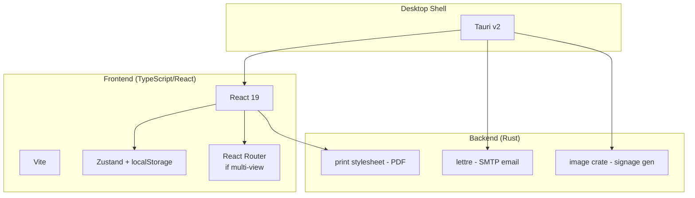

# Greenfield Rewrite Plan — Lunch Menu Publisher

> Generated June 2, 2026

---

## Table of Contents

1. [Current State Analysis](#1-current-state-analysis)
2. [Rewrite Goals](#2-rewrite-goals)
3. [Recommended Tech Stack](#3-recommended-tech-stack)
4. [Architecture Overview](#4-architecture-overview)
5. [Feature Inventory](#5-feature-inventory)
6. [Enhancement Features](#6-enhancement-features)
7. [Phased Implementation Plan](#7-phased-implementation-plan)
8. [Key Decisions](#8-key-decisions)
9. [Session 2 Brainstorming](#9-session-2-brainstorming-outcomes-june-3-2026)

---

## 1. Current State Analysis

### What Exists Now

The **Lunch Menu Publisher** is a Tauri v1 desktop application with a vanilla JavaScript frontend (no framework, no bundler) and a Rust backend for SMTP email. It lets a cafeteria manager at a Christian school create monthly lunch menus, optionally add a Bible verse, and export to PDF, plain text, or email.

A separate **Python script** (in a different project directory) fetches the emailed menu via IMAP and generates digital signage slides for BrightAuthor HD224 boxes.

### Codebase Pain Points

| Issue | Severity | Detail |
|-------|----------|--------|
| No module system | ❌ High | `import` in `email-export.js` won't load without `type="module"` on the script tag |
| No type safety | ❌ Medium | Vanilla JS — runtime bugs that TypeScript would catch at compile time |
| Duplicated toast logic | ⚠️ Low | Same 30-line inline CSS function copied in `state.js` and `verses.js` |
| Outdated `lettre_email` crate | ⚠️ Medium | v0.1 from 2021 — modern `lettre` has its own email builder |
| Zero test coverage | ❌ High | No unit, integration, or E2E tests anywhere |
| No build step | ⚠️ Medium | Raw `<script>` tags = global scope pollution, no tree-shaking, no code splitting |
| Inline CSS in JS | ⚠️ Low | Toast notifications use `style.cssText` instead of CSS classes |
| Email-signage middleman | ❌ Medium | App → SMTP → Email → IMAP → Python script is fragile and introduces latency |

### What Works Well (Keep These Ideas)

- ✅ **CSS print stylesheet for PDF** — proven, reliable, produces clean output on any printer
- ✅ **localStorage persistence** — simple, fits the single-user offline model perfectly
- ✅ **Mouse-based drag-and-drop** — custom implementation works reliably in Tauri's webview
- ✅ **Collapsible side panels** — maximizes calendar space on smaller screens
- ✅ **NO SCHOOL day system** — thoughtful luminance-based design works in B&W and for color-blind users

---

## 2. Rewrite Goals

From user discussion:

1. **Clean slate, same features + enhancements** — not just a port, add meaningful new capabilities
2. **Fold the Python digital signage script in** — eliminate the SMTP/IMAP middleman entirely
3. **No preference on language** — choose the best tool for the job

### Design Principles

| Principle | Meaning |
|-----------|---------|
| **Offline-first** | All data local, zero server dependencies for core functionality |
| **Type-safe** | Catch bugs at compile time, not runtime |
| **Tested** | At minimum unit tests for data logic and export formatting |
| **Self-contained** | Single installable binary — no Python runtime, no email server dance |
| **Fast to iterate** | Hot module reload, instant builds, clean component architecture |

---

## 3. Recommended Tech Stack

### Top Pick: Tauri v2 + TypeScript + React + Vite



### Why This Stack

| Reason | Detail |
|--------|--------|
| **Existing Rust investment** | The SMTP email code in `src-tauri/src/main.rs` ports directly to Tauri v2's plugin system |
| **Small binary** | ~5MB vs Electron's ~150MB. Important for school IT departments with limited download bandwidth |
| **TypeScript** | Catches the class of bugs currently endemic in the vanilla JS codebase |
| **React ecosystem** | Largest community, most tutorials, easiest to hire for or find help |
| **Vite** | Instant HMR in dev, tree-shaken production builds, zero-config TypeScript support |
| **Rust for signage** | The `image` crate replaces Python's Pillow — no need to bundle a Python runtime |

### Why Not Alternatives

| Option | Problem |
|--------|---------|
| **Electron** | 150MB+ installer for an app that manages text and dates. Heavy overkill. |
| **Flutter Desktop** | Desktop is Flutter's weakest platform. Signage integration means keeping a second language. Smaller dev community. |
| **Python desktop (Qt/PySide)** | Verbose UI code. PyInstaller packaging is fragile. Poor webview support. |
| **Pure Rust GUI (egui/Druid)** | Excellent performance, but UI layout is written in code instead of HTML/CSS. Slower iteration. |
| **Svelte** | Leaner than React but smaller ecosystem. Fine choice if preferred, but React is safer as a default. |

---

## 4. Architecture Overview

### Project Structure

```
lunch-menu-publisher/
│
├── src-tauri/                          # Rust backend (Tauri v2)
│   ├── src/
│   │   ├── main.rs                     # Tauri entry point, command registration
│   │   ├── lib.rs                      # Plugin setup
│   │   ├── email.rs                    # SMTP email sending (port from current)
│   │   └── signage.rs                  # Digital signage image generation (NEW)
│   ├── Cargo.toml
│   ├── tauri.conf.json
│   └── .env.example                    # EMAIL_USER, SMTP_HOST, etc. (gitignored)
│
├── src/                                # React + TypeScript frontend
│   ├── components/
│   │   ├── Layout/
│   │   │   ├── Header.tsx              # App header, month nav, action buttons
│   │   │   ├── Panel.tsx               # Collapsible side panel wrapper
│   │   │   └── Toolbar.tsx             # Action buttons row
│   │   ├── Calendar/
│   │   │   ├── CalendarGrid.tsx        # Monthly grid (7 columns)
│   │   │   ├── DayCell.tsx             # Individual day cell
│   │   │   ├── DayHeader.tsx           # Sun-Sat headers
│   │   │   └── VerseDisplay.tsx        # Verse text + reference
│   │   ├── Tiles/
│   │   │   ├── TileLibrary.tsx         # Tile panel with drag source
│   │   │   ├── Tile.tsx                # Individual draggable tile
│   │   │   └── AddTileButton.tsx       # + button to create new tiles
│   │   ├── Modals/
│   │   │   ├── SettingsModal.tsx       # Settings form
│   │   │   ├── VerseSelector.tsx       # Curated + advanced verse picker
│   │   │   └── ExportModal.tsx         # Text export + copy
│   │   └── Shared/
│   │       ├── Toast.tsx               # Reusable toast notification
│   │       ├── Modal.tsx               # Generic modal wrapper
│   │       └── Button.tsx              # Styled button variants
│   │
│   ├── stores/
│   │   ├── menuStore.ts                # Menu state (current month, days data)
│   │   ├── tileStore.ts                # Tile library (entrees, sides, specials)
│   │   ├── settingsStore.ts            # App settings + localStorage sync
│   │   └── verseStore.ts               # Current verse, curated data, bible data
│   │
│   ├── hooks/
│   │   ├── useLocalStorage.ts          # Generic localStorage sync hook
│   │   ├── useDragAndDrop.ts           # Mouse-based drag-and-drop (Tauri-compat)
│   │   └── useKeyboardShortcuts.ts     # Keyboard navigation
│   │
│   ├── utils/
│   │   ├── dates.ts                    # Month/year helpers, day calculations
│   │   ├── export.ts                   # Plain text export generation
│   │   ├── validation.ts              # Input validation helpers
│   │   └── toast.ts                    # Toast notification logic
│   │
│   ├── types.ts                        # All TypeScript interfaces/types
│   ├── App.tsx                         # Root component
│   └── main.tsx                        # Entry point
│
├── public/
│   └── data/
│       ├── curated-verses.json         # Curated Bible verses (month-tagged)
│       └── kjv-bible.json              # Full KJV Bible
│
├── tests/                              # Unit + integration tests
│   ├── stores/
│   │   ├── menuStore.test.ts
│   │   └── settingsStore.test.ts
│   ├── utils/
│   │   ├── dates.test.ts
│   │   └── export.test.ts
│   └── components/
│       └── Calendar.test.tsx
│
├── package.json
├── tsconfig.json
├── vite.config.ts
├── vitest.config.ts                    # or jest.config.ts
└── index.html
```

### Data Flow

```
User Interaction
      │
      ▼
React Component ──► Zustand Store ──► localStorage (persistence)
      │                    │
      │                    ▼
      │              Derived state
      │              (re-renders)
      │
      ├─► Tauri Command (Rust) ──► Email sending
      │
      └─► Tauri Command (Rust) ──► Signage image files
```

### TypeScript Interfaces (types.ts)

```typescript
// Core data types
interface Tile {
  id: string;
  name: string;
  type: 'entree' | 'side' | 'special';
}

interface DayData {
  date: string;           // "YYYY-MM-DD"
  entree: string;
  sides: string[];
  special: string;        // Extra-purchase food item e.g. "Reuben"
  specialEvent: string;   // School event e.g. "Archery Fundraiser"
  isNoSchool: boolean;
}

interface Menu {
  month: number;          // 0-11
  year: number;
  days: Record<string, DayData>;
  verse: Verse | null;
}

interface Verse {
  text: string;
  reference: string;
}

interface CuratedVerse extends Verse {
  months: number[];       // 1-12
  holiday?: string;
}

interface AppSettings {
  compactGridEnabled: boolean;
  versesEnabled: boolean;
  advancedVerseLookup: boolean;
  pdfEmail: string;
  txtEmail: string;
}

// State store types
interface MenuStore {
  currentMonth: number;
  currentYear: number;
  getMenu(): Menu;
  getDay(date: string): DayData;
  setDay(date: string, data: DayData): void;
  setVerse(verse: Verse | null): void;
  navigateMonth(delta: number): void;
}

interface TileStore {
  entreeTiles: Tile[];
  sideTiles: Tile[];
  specialEventTiles: Tile[];
  addTile(type: string, name: string): void;
  removeTile(id: string): void;
  reorderTiles(type: string, tiles: Tile[]): void;
  undo(): void;
}

interface SettingsStore {
  settings: AppSettings;
  updateSetting<K extends keyof AppSettings>(key: K, value: AppSettings[K]): void;
}
```

---

## 5. Feature Inventory

### Must-Have (Same as Current App)

| Feature | Description |
|---------|-------------|
| Monthly calendar grid | 7-column layout with weekend columns narrower |
| Day cell display | Entree, sides, special events, milk per school day |
| Tile libraries | Entrees (grid), Sides (grid), Special Events (grid) |
| Drag-and-drop to calendar | Mouse-based drag (Tauri-compatible) from tiles to day cells |
| Inline editing | Click a day cell to type in entree/sides/special format |
| NO SCHOOL toggling | Per-day NS button, weekend auto-NOSCHOOL, visual indicators |
| Bible verses | Curated (month-filtered) + advanced (KJV book/chapter/verse) |
| Settings | Compact grid toggle, verse toggle, advanced lookup toggle, email recipients |
| Text export | Plain text generation, modal with copy button |
| PDF export | CSS print stylesheet, landscape letter, preview mode |
| Email PDF | opens mailto: link with prefilled recipient |
| Email TXT | SMTP email with menu.txt attachment |
| Panel collapse | Collapsible left/right panels with vertical text headers |
| State persistence | localStorage save/load for all data |

### Enhancement Features (New in Rewrite)

| Feature | Priority | Effort | Description |
|---------|----------|--------|-------------|
| Digital signage generation | P0 | Medium | Rust `image` crate renders menu text onto template images, outputs files for BrightAuthor HD224 |
| Undo/redo system | P1 | Low | Full undo stack for all actions (tile deletion, day edits, NO SCHOOL toggles) |
| Month template cloning | P1 | Low | "Copy from last month" button to start with existing menu |
| Autosave indicator | P1 | Trivial | Visual feedback when data is saved to localStorage |
| Direct PDF save dialog | P1 | Medium | Use Tauri's file dialog to save PDF directly (skip browser print dialog) |
| Searchable verse picker | P2 | Medium | Filter curated verses by keyword in addition to month filtering |
| Keyboard shortcuts | P2 | Low | Ctrl+Arrow for month nav, Ctrl+P for print, Ctrl+Z for undo |
| Dark mode | P3 | Low | CSS custom properties toggle |
| Multi-month overview | P3 | Medium | Quick-jump between months, see which have data |
| Unit tests | P0 | Medium | Tests for stores, export logic, date utilities |

---

## 6. Signage Generation (Folding the Python Script In)

### Current Flow (To Be Replaced)

```
Tauri App ──SMTP──▶ Email ──IMAP──▶ Python Script ──▶ Signage JPEGs
```

### New Flow

```
Tauri v2 App (Rust backend)
      │
      ├── image crate loads template background
      ├── ab_glyph crate renders text (entree, sides, special)
      ├── Composites text onto template
      └── Outputs JPEG/PNG files to user-chosen directory
```

### Rust Dependencies

```toml
[dependencies]
image = { version = "0.25", default-features = false, features = ["png", "jpeg"] }
ab_glyph = "0.2"        # Font rendering
```

### High-Level API

```rust
#[tauri::command]
fn generate_signage(
    month: i32,
    year: i32,
    template_path: String,
    output_dir: String,
    school_name: String,
) -> Result<Vec<String>, String> {
    // 1. Read menu data from frontend state
    // 2. For each school day, load template background
    // 3. Render entree, sides, special event text via ab_glyph
    // 4. Save as "MM_DD_YYYY.jpg" in output_dir
    // 5. Return list of generated file paths
}
```

This eliminates:
- The separate Python project
- The SMTP/IMAP email infrastructure
- The .env configuration for email credentials
- Email delivery failures and delays
- The need for internet connectivity

---

## 7. Phased Implementation Plan

### Phase 1: Foundation (Estimated: 1 session)

**Goal**: Scaffolded project, running app with blank calendar

- [ ] Initialize Tauri v2 project with React + TypeScript + Vite template
- [ ] Configure TypeScript, ESLint, Prettier
- [ ] Set up Vitest for testing
- [ ] Define all TypeScript types in `types.ts`
- [ ] Implement Zustand stores (menuStore, tileStore, settingsStore, verseStore)
- [ ] Implement `useLocalStorage` hook for persistence
- [ ] Create basic App layout shell (Header, Panel, Calendar area)
- [ ] Port CSS variables and base styles from `app.css`
- [ ] **Deliverable**: App window opens, React components render, state persists to localStorage

### Phase 2: Calendar + Tiles (Estimated: 2 sessions)

**Goal**: Functional calendar with drag-and-drop tile library

- [ ] Implement `CalendarGrid.tsx` — 7-column grid, day header rendering
- [ ] Implement `DayCell.tsx` — date number, content display, weekend/NO SCHOOL states
- [ ] Implement month navigation (prev/next buttons, month/year display)
- [ ] Implement `TileLibrary.tsx` — grid of tiles with entree/side/special styling
- [ ] Implement `Tile.tsx` — draggable element with delete button
- [ ] Implement `useDragAndDrop.ts` — mouse-based drag (Tauri-compatible, no HTML5 drag API)
- [ ] Implement drop target highlighting and data flow (tile → day cell)
- [ ] Implement inline editing (click cell → type entree/sides/special)
- [ ] Implement NO SCHOOL toggle (NS button, weekend auto-detect)
- [ ] Implement natural milk display on school days
- [ ] Implement panel collapse behavior
- [ ] Port CSS from `app.css` for calendar, tiles, panels
- [ ] Port plain text export generation logic
- [ ] Write tests for date utilities, export logic
- [ ] **Deliverable**: Full monthly calendar with drag-and-drop, editing, and export

### Phase 3: Verses + Settings (Estimated: 1 session)

**Goal**: Verse selection, settings modal, PDF preview mode

- [ ] Implement verse display component in calendar header
- [ ] Implement curated verse modal (month-filtered list)
- [ ] Implement advanced verse lookup (book → chapter → verse dropdowns)
- [ ] Implement settings modal with all toggle/input fields
- [ ] Implement PDF preview mode (hide UI, show calendar only)
- [ ] Port PDF print stylesheet from `pdf.css`
- [ ] Wire up settings changes to store
- [ ] Write tests for verse filtering logic
- [ ] **Deliverable**: Full verse system, settings persistence, print layout

### Phase 4: Email + Signage (Estimated: 2 sessions)

**Goal**: SMTP email functionality and digital signage generation

- [ ] Port `send_menu_email` Tauri command from Tauri v1 to v2
- [ ] Wire up Email TXT button to call Rust command
- [ ] Wire up Email PDF button (mailto fallback)
- [ ] Implement `signage.rs` — Rust image generation using `image` + `ab_glyph` crates
- [ ] Add "Generate Signage" button with settings for template path and output directory
- [ ] Wire up Tauri file/open dialogs for template selection and output folder
- [ ] Write tests for Rust command error handling
- [ ] **Deliverable**: Email sending works, signage images generate from within the app

### Phase 5: Enhancement Features (Estimated: 1-2 sessions)

**Goal**: Polish and new features

- [ ] Implement full undo/redo system (wraps store actions)
- [ ] Implement month template cloning
- [ ] Implement autosave indicator (subtle "Saved" badge)
- [ ] Implement direct PDF save via Tauri file dialog
- [ ] Implement keyboard shortcuts (Ctrl+Arrow, Ctrl+P, Ctrl+Z)
- [ ] Implement searchable verse picker (filter by keyword)
- [ ] Implement dark mode toggle
- [ ] **Deliverable**: Polished app with all enhancements

### Phase 6: Testing + Polish (Estimated: 1 session)

**Goal**: Production-quality release

- [ ] Write unit tests for all stores
- [ ] Write integration tests for export formatting
- [ ] Add error boundaries in React
- [ ] Handle edge cases (February 29th, empty menus, corrupt localStorage)
- [ ] Accessibility audit (keyboard navigation, screen reader labels)
- [ ] Performance profiling (KJV Bible load time, calendar re-render)
- [ ] Build installer and test on clean Windows machine
- [ ] **Deliverable**: Production-ready .msi installer

---

## 8. Key Decisions (Decided June 3, 2026)

### ✅ Bible Verses: Keep both curated + KJV, fix advanced lookup

**Decision**: Keep the dual verse system (curated + advanced KJV lookup).
- Curated verses (month-filtered) for quick selection — no bugs, works as-is
- Advanced KJV book/chapter/verse for precise selection — **needs a structural fix**
- KJV Bible lazy-loaded on first use of advanced lookup

**Root cause of KJV bugs**: Data structure mismatch.
- The code expects a nested format: `{ "Genesis": [ ["verse1", ...], ... ] }`
- The actual file is a flat array: `{ verses: [{ book_name, chapter, verse, text }, ...] }`
- Fix: Transform flat array → nested index on load via: `groupBy(book → chapter → verse)`

### ✅ Workflow: Start from scratch each month

**Decision**: Each month starts fresh with a blank calendar.
- The drag-and-drop tile system is the primary way to build menus
- No "copy from last month" feature needed (but could be a Phase 5 nice-to-have)
- Menus are unique per month, not repeating weekly patterns
- Mid-month edits are rare but supported via inline editing
- Print happens once at the beginning of the month for the full month

### ✅ Tile System: Three libraries, "Specials" as extras

**Decision**: Three tile libraries: Entrees, Sides, Special Events.

**Special Events** include:
- School events: Archery Fundraiser, Grandparents Day, Pastor Appreciation Day
- Holiday-specific tiles (optional Phase 2 enhancement)

**Specials** are extra-purchase food items available in addition to the regular meal (e.g. Reuben, Pulled Pork BBQ Sandwich). They are NOT the same as Special Events.

**DayData model** updated with separate `special` and `specialEvent` fields:
```typescript
interface DayData {
  date: string;
  entree: string;
  sides: string[];
  special: string;           // Extra-purchase food item e.g. "Reuben"
  specialEvent: string;      // School event e.g. "Archery Fundraiser"
  isNoSchool: boolean;
}
```

**Tile library** expanded to four categories:
1. Entrees — main course for the day
2. Sides — veggies, starches, bread, milk
3. Specials — extra-purchase food items
4. Special Events — school events

### ✅ Bible Verses: Keep both curated + KJV, fix advanced lookup

**Decision**: Keep the dual verse system (curated + advanced KJV lookup).
- The current KJV lookup has bugs — this is a fix, not a removal
- Curated verses (month-filtered) for quick selection
- Advanced KJV book/chapter/verse for precise selection
- KJV Bible lazy-loaded on first use of advanced lookup

### ✅ Multi-Month: Single month view only

**Decision**: Navigate one month at a time with prev/next arrows.
- Never need to plan more than one month ahead
- No semester planning or month-locking needed
- Simple month navigation is sufficient

### ✅ Exports: One "Send" button does everything

**Decision**: A single **"Send"** button triggers all active exports at once.
- No scattered export buttons around the UI
- One click sends PDF, plain text, signage JPEGs, Kiosk JSON, and optionally emails
- People-facing exports (PDF, signage) must **look polished**
- Technical exports (JSON, email attachments) just need to be correct

| Export | Format | Audience | Priority |
|--------|--------|----------|----------|
| Printed menu | PDF via CSS print | Cafeteria manager (paper) | P0 |
| SIS text | Plain text | School information system | P0 |
| Email PDF | mailto: link | Admin/parents | P0 |
| Email TXT | SMTP via Rust | Admin/parents | P0 |
| HD224 slides | 1920×1080 JPEGs | Student-facing TV displays | P0 |
| Kiosk JSON | JSON file → Drive | Kioskv5 app | P1 |
| Kitchen Dashboard | Google Sheets row | Future | P2 |

### ✅ Local File Backup: Both JSON + TXT

**Decision**: On every "Send" and month change, write two backup files to `Documents/Lunch Menus/`:

- **September_2026_menu.json** — structured JSON for machine readability
- **September_2026_menu.txt** — plain text summary for human readability

Triggers:
- **On "Send"** — writes backup
- **On month change** (navigating prev/next) — writes current month before switching
- **On app close** — writes final save of current month

File location: `Documents/Lunch Menus/` — if this folder is inside Google Drive sync, backups automatically replicate to the cloud.

### ✅ CSS Strategy: Tailwind CSS

**Decision**: Use Tailwind CSS for all new UI components.
- Utility-first, component files are self-contained
- No porting of existing CSS line-by-line — rewrite UI with Tailwind classes
- Standard React ecosystem choice in 2026

### ✅ PDF Strategy: Print stylesheet only (MVP)

**Decision**: Keep the CSS print stylesheet approach for now.
- It's proven to work — the current app produces clean PDFs
- "Print" in Tauri opens the system print dialog → user selects "Save as PDF"
- One-click programmatic PDF save is deferred (post-MVP enhancement)

### ✅ Platform Target: Windows only

**Decision**: Windows-only with MSI installer, same as current.
- Tauri supports cross-platform easily, but targeting Windows alone simplifies testing and QA
- App is distributed internally within a school — no need for macOS/Linux builds
- Can expand to other platforms later if needed

### ✅ Email Provider: Gmail SMTP

**Decision**: Configure for Gmail SMTP (smtp.gmail.com, port 587, STARTTLS).
- Requires an App Password (not regular Gmail password)
- Environment variables: EMAIL_USER, EMAIL_PASSWORD, SMTP_HOST=smtp.gmail.com, SMTP_PORT=587
- `.env.example` will document this setup

### ✅ Fonts: Bundle for offline use

**Decision**: Download and bundle Crimson Text, Dancing Script, and Open Sans as static font files.
- App works entirely offline (important for school environments with restricted internet)
- Font files stored in `src/assets/fonts/` and loaded via CSS `@font-face`
- Adds ~200KB to the bundle — negligible for a desktop app

### ✅ Store Architecture: Zustand

Use **Zustand** over Redux or Context:
- Tiny bundle (~1KB)
- No boilerplate
- Works outside React (for testing)
- Middleware for localStorage persistence built-in (`persist` middleware)
- TypeScript-first API

### ✅ Drag-and-Drop: Custom mouse-based

**Custom mouse-based implementation** (same approach as current app):
- Tauri's webview has inconsistent HTML5 Drag API support
- Mouse events (`mousedown`, `mousemove`, `mouseup`) work reliably everywhere
- Create a floating ghost element on `mousedown`
- Hit-test against calendar cells on `mousemove`
- Dispatch update on `mouseup`

### ✅ Data File Strategy: Lazy-load KJV from resources

- `curated-verses.json` (~20KB) — bundle directly with app
- `kjv-bible.json` (~800KB) — load from Tauri resource folder on first use of advanced verse lookup
- Show a brief loading state (200ms from localStorage)
- Cache in memory for session duration — no IndexedDB complexity needed

### ✅ Testing Strategy: Progressive, not all in Phase 6

- **Phase 2**: Test date utilities and export logic as pure functions (highest-value, easiest tests)
- **Phase 3**: Test verse filtering logic
- **Phase 5**: Test undo/redo store logic
- **Phase 6**: Fill remaining gaps (component smoke tests, edge cases)

### ✅ Undo/Redo: Snapshot approach

- Save full state snapshot before each mutation
- Simple, correct for an app of this size
- Snapshot-based undo is trivially implemented with Zustand middleware
- Command pattern is overkill here

### ✅ Signage Integration: Deferred until Python script details available

- Stub the `signage.rs` interface in Phase 4 with a placeholder command
- Fill in the actual image generation once the Python script's template format, resolution, and file naming convention are shared

---

## 9. Session 2: Brainstorming Outcomes (June 3, 2026)

### System Landscape Discovery

Four separate systems were discovered that all deal with lunch at Somerset Christian School:

```
1. Lunch Program (Tauri v1)         ─ Monthly menu creation, PDF/text/email
2. Lunch Menu Integrated (Python)   ─ Signage slide generation → BrightSign HD224
3. Kioskv5 (Full-stack React)       ─ Student/visitor check-in + lunch selection (HAS MENU STUB)
4. Google Sheets Blueprint (Planned)─ Teacher count submissions → Kitchen Dashboard (NOT YET BUILT)
```

### Two Distinct Data Streams

| Stream | What | User |
|--------|------|------|
| **THE MENU** (what's cooking) | Created monthly by cafeteria manager in the desktop app | Cafeteria Manager |
| **THE COUNTS** (who wants what) | Submitted daily by teachers via Google Sheets | Teachers → Kitchen Staff |

These streams currently don't connect. The unified app primarily owns **the menu** stream.

### Two-User Workflow

| User | Role | Tool | Cadence |
|------|------|------|---------|
| **Cafeteria Manager** | Creates monthly menu | Unified Tauri desktop app | Once/month |
| **You (Admin)** | Generates signage, manages infrastructure | Same app (different features) + BrightAuthor | Monthly + occasional |

### Google Drive as Central Hub

**Decision**: Google Drive will host all shared storage files, acting as the filesystem bridge between components.

```
Google Drive folder structure:
├── menu_data/
│   ├── current.json          ← Menu JSON for Kiosk to consume
│   └── menu_slides/          ← 1920×1080 JPEGs for HD224 signage
├── lunch_spreadsheets/       ← Teacher count submission sheets
├── food_assets/              ← Transparent PNG asset library
│   ├── corn_dog.png
│   ├── chicken_bake.png
│   └── ...
└── kitchen_dashboard/        ← Future: master sheet + counts
```

**Workflow**:
1. Cafeteria manager creates menu in the app → app writes `current.json` + signage JPEGs to a local folder that syncs to Google Drive
2. You log into BrightAuthor, browse to the synced Drive folder, publish slides to HD224s
3. Kioskv5 reads `current.json` from Drive (or syncs it locally) for live menu data
4. Future: Kitchen Dashboard (Chromebook → TV) reads from the Google Sheets ecosystem

### Kiosk Menu Integration

**File-based approach** selected over API-based:
- Unified app writes `current.json` to a shared Drive folder
- Kioskv5 reads this JSON file (via local sync or Drive API call)
- JSON schema:
  ```json
  {
    "date": "2026-06-03",
    "mainCourse": "Cheeseburger",
    "sides": ["Corn", "Apple Slices", "Milk"],
    "special": "Chicken Bake"
  }
  ```
- This replaces the current hardcoded stub in `lunchMenu.ts`

### Food Tray Compositing System

Based on `SCS_Menu_System.md` document provided by the user:

**Core concept**: Deterministic visual pipeline — compositing reusable transparent PNG food assets onto a fixed tray template, rather than relying on unreliable image search APIs.

**Components**:
- **Tray Template**: Single 1920×1080 `tray_base.png` as the foundation for every slide
- **Slot Mapping**: Fixed (x, y, w, h) coordinates for each meal component (main, sides, bread, milk)
- **Food Asset Library**: ~32 transparent PNGs, categorized by type
- **Compositing Engine**: Rust `image` crate pastes assets into slots on the template
- **Menu Mapping**: Text is normalized to filenames (e.g., "Corn Dog" → `corn_dog.png`)

**Approach replaces**: Unsplash API (unreliable for specific school dishes), the Python PIL/Pillow rendering, and the IMAP email middleman.

### Menu Item Catalog (Complete)

**32 assets needed total**:

**Entrees (20):** Archery Fundraiser, Baked Spaghetti, Biscuits and Gravy, Cheese Quesadilla, Chicken Biscuit, Chicken Leg Quarter, Chicken Tenders, Chili, Eggs, Grilled Cheese, Lasagna Soup, Meatloaf, Pancakes, Pizza, Potato Soup, Pulled Pork Mac and Cheese, Pulled Pork Nachos, Queso Soup, Taco, Turkey and Gravy, Walking Taco

**Sides (10):** Carrots and Ranch, Chips, Fruit, Green Beans, Mashed Potatoes, Pasta Salad, Rice, Roasted Broccoli, Salad, Veggies

**Bread (2):** Bread, Cheddar Biscuit

**Drink (1):** Milk

**Dessert (1):** Dessert (generic or typographic)

**Non-food:** No School (text-only slide)

### Food Asset Generation Strategy

**Decision**: API batch generation (TBD), not local GPU.

| Factor | Reality |
|--------|--------|
| Server GPU | None — PowerEdge R740 has no GPU card |
| Laptop | No GPU suitable for ML inference |
| CPU-only Stable Diffusion | Viable but slow (~3-5 min per image, batch overnight) |
| API alternatives | Flux Pro API (~$1.20/40 images), DALL-E 3 (~$1.60/40 images) |

**Recommendation**: Use an API (Flux or DALL-E 3) for the one-time batch generation of ~32 assets, then run through `rembg` for transparency. Server-based CPU generation deferred as a "build the pipeline later" option.

### Google Sheets Blueprint & Kitchen Dashboard

- **Status**: Planned, not implemented
- **Design document**: `Master_Architecture_Blueprint_Final (2).txt` outlines:
  - Tier 1: Classroom templates (55+ classrooms)
  - Tier 2: Hub sheets (Elementary, Middle, High, Faculty, Kiosk) via IMPORTRANGE
  - Tier 3: Kitchen Master Dashboard via COUNTIF aggregations
  - Automation: Google Apps Script for nightly data reset
- **Timeline**: After the unified app rewrite — downstream future system
- **Integration point**: The unified app will need to export menu data in a format that the Google Sheets system can consume (e.g., a row per day with entree + sides)

### BrightSign HD224 Details

- **Three units** throughout the building (hallways, cafeteria)
- **Current workflow**: Python generates JPEGs → BrightAuthor publishes to SD card → Insert into HD224
- **Target workflow**: App generates JPEGs → syncs to Google Drive → BrightAuthor reads from Drive → publish
- **Resolution**: 1920×1080 (standard HD)
- **Format**: JPEG
- **Also planned**: AI-generated food images on HD224s ("look what's for lunch" for students)

### What Gets Eliminated in the Unified App

| ❌ Gone | ✅ Replaced by |
|---------|---------------|
| Python scripts (4 files) | Rust `image` + `ab_glyph` crates |
| Python dependencies (5 packages) | Zero Python runtime needed |
| IMAP email polling for signage | Direct generation from app state |
| SMTP email middleman | Direct menu data access |
| Unsplash API calls | Bundled transparent PNG assets |
| Separate `menu.csv` | App's own state as source of truth |
| Switching between 3 projects | Single app, single workflow |
| Kiosk hardcoded menu stub | Live menu JSON from Drive |

### Remaining Open Questions (Non-Blocking)

1. **Kiosk menu integration** — Should the app write JSON to a Drive folder polled by Kioskv5, or should there be a lightweight server? (File-based approach selected for now)
2. **HD224 delivery** — BrightAuthor reading from a synced Drive folder vs. direct SD card? (Drive sync selected for now)
3. **Asset batch generation detail** — When ready, which API (Flux vs DALL-E 3 vs Recraft) and exact batch script approach

---

## Appendix: Current Project File Reference

| File | What It Does | Rewrite Fate |
|------|-------------|-------------|
| `index.html` | Entry point | Replace with Vite-generated HTML |
| `js/app.js` | App init | → `src/App.tsx`, `src/main.tsx` |
| `js/state.js` | State + localStorage | → `src/stores/*.ts` with Zustand |
| `js/calendar.js` | Calendar rendering | → `src/components/Calendar/*.tsx` |
| `js/editing.js` | Inline editing | → merged into `DayCell.tsx` |
| `js/tiles.js` | Tile library + drag | → `src/components/Tiles/*.tsx` + `useDragAndDrop.ts` |
| `js/verses.js` | Verse selection | → `src/components/Modals/VerseSelector.tsx` |
| `js/settings.js` | Settings + panel collapse | → `src/components/Modals/SettingsModal.tsx` |
| `js/text-export.js` | Plain text export | → `src/utils/export.ts` |
| `js/email-export.js` | Email via Tauri command | → `src-tauri/src/email.rs` + React button |
| `css/app.css` | Interactive styles | → `src/**/*.css` (Tailwind CSS) |
| `css/pdf.css` | Print stylesheet | → `src/pdf.css` (ported, kept as-is) |
| `data/curated-verses.json` | Curated verses | → `public/data/` (unchanged) |
| `data/kjv-bible.json` | Full KJV Bible | → `public/data/` (unchanged) |
| `src-tauri/src/main.rs` | Tauri v1 + email | → `src-tauri/src/email.rs` (ported to v2) |
| `src-tauri/Cargo.toml` | Rust deps | Replace with Tauri v2 dependency set |
| `src-tauri/tauri.conf.json` | Tauri config | Rewrite for Tauri v2 schema |
| Python script (separate) | Signage generation | → `src-tauri/src/signage.rs` |

---

*End of planning document. Discuss on June 3, 2026.*
